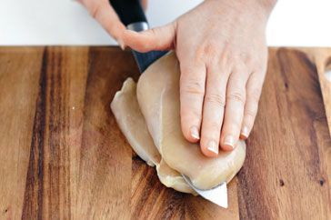

# Healthy Saleeq White Chicken Breasts

## Ingredients
- Box of chicken breasts
- Egyptian rice / American rice
- 1 onion (Cut into half)
- قرنفل (Cloves)
- Cardamom
- 1 tsp of salt
- 1 tsp of black pepper
- 1 tsp of cinnamon
- Bay leaves
- Maggi cube (Chicken Stock)

### Instructions
1. Wash the rice and soak it in water for 30 minutes
2. In a pot, add onion, cloves, salt, black pepper, cinnamon, bay leaves, and Maggi cube
3. Add water and bring to a boil
4. Simmer for 10 minutes
5. Remove the onion and bay leaves
6. Add the rice and cook for 10 minutes
7. Add milk and cook for 10 minutes

### Cooking Chicken
1. Preheat the oven to 180 degrees C
2. Cut the chicken breasts in half fillet

2. Season with salt, black pepper, and olive oil
3. On hot pan, Sear the chicken on both sides
4. Place the chicken in the pot and cook for 20 minutes in the oven
5. Take it out when internal temperature reaches 75 degrees C / 165 degrees F

## Serving
- Serve with Duggus Salad (Peper Salad)